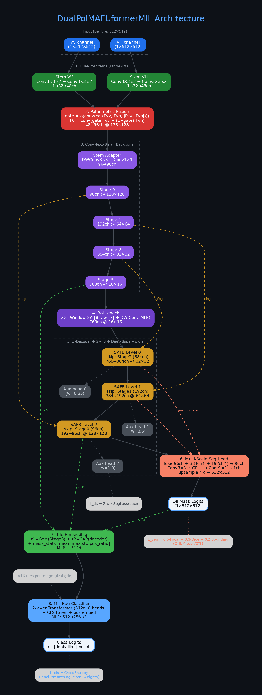

# DualPolMAFUformerMIL — SAR Oil Spill Detection

Модель для обнаружения и сегментации нефтяных разливов по спутниковым снимкам Sentinel-1 SAR.
Поддержка распределённого обучения на нескольких GPU через **PyTorch DDP** (DistributedDataParallel).

## Архитектура

**DualPolMAFUformerMIL** (72.24M параметров) — гибридная модель:



| Блок | Описание |
|------|----------|
| **Dual-pol Stems** | Отдельные Conv3x3 stride2 для VV и VH (1→32→48ch) |
| **Polarimetric Fusion** | Gated attention: gate = σ(conv(cat(Fvv, Fvh, \|Fvv−Fvh\|))), 48→96ch |
| **Backbone** | ConvNeXt-Small (timm), channels [96, 192, 384, 768] |
| **Bottleneck** | 2× Window Self-Attention (8 heads, win 7) + DW-Conv MLP |
| **Decoder** | 3-level SAFB (gated skip fusion) + deep supervision [384, 192, 96] |
| **Seg Head** | Multi-scale fusion + Conv3x3 → GELU → Conv1x1 → 1ch, upsample 4× |
| **Tile Embedding** | GeM(stage4) + GAP(decoder) + mask_stats → MLP → 512d |
| **MIL Classifier** | 2-layer Transformer (512d, 8h) + CLS token → MLP → 3 classes |

## Датасет

[Zenodo Sentinel-1 SAR Oil Spill Dataset](https://zenodo.org/records/8346860) (Parts I–III)

| Набор | oil | lookalike | no_oil | Итого |
|-------|-----|-----------|--------|-------|
| Train/Val | 1200 | 685 | 685 | 2570 |
| Test | 150 | 150 | 150 | 450 |

- Снимки: **2048 × 2048 × 2** (VV + VH), Sigma0 в дБ, GeoTIFF
- Маски: бинарные 2048 × 2048 (oil class), пустые (lookalike/no_oil)
- Медианная доля нефти: **1.76%** пикселей

## Структура проекта

```
oil_detection/
├── config.py              # Конфигурация (dataclasses)
├── dataset.py             # Dataset, тайлинг, SAR-аугментации, copy-paste
├── losses.py              # FocalLoss + DiceLoss + BoundaryLoss + OHEM + DeepSupervision
├── metrics.py             # macro-F1, IoU, Dice, confusion matrix, FP area
├── train.py               # Training loop (DDP, AMP, EMA, grad accumulation)
├── inference.py           # Sliding-window inference + TTA
├── utils.py               # Seed, EMA, cosine scheduler, checkpoints
├── model/
│   ├── stems.py           # Dual-pol shallow stems (VV / VH)
│   ├── fusion.py          # Polarimetric gated fusion
│   ├── backbone.py        # ConvNeXt backbone (timm)
│   ├── bottleneck.py      # Window Self-Attention + DW-Conv MLP
│   ├── decoder.py         # U-Decoder + SAFB + deep supervision
│   ├── heads.py           # Multi-scale SegHead + TileEmbed + MIL classifier
│   └── dualpol.py         # Полная сборка DualPolMAFUformerMIL
├── analyze_data.py        # Анализ датасета (3 класса, SAR-статистика)
├── visualize_data.py      # Визуализация примеров
├── generate_report.py     # Генерация MD/PDF отчёта с графиками
└── md_to_pdf.py           # MD → PDF конвертер
```

## Установка

```bash
pip install torch torchvision timm rasterio numpy pandas matplotlib seaborn scipy weasyprint markdown
```

## Подготовка данных

Скачать 3 части с Zenodo и распаковать:

```
$DATA_DIR/
├── Oil/              # Part I — train/val нефть (1200)
├── Mask_oil/
├── Lookalike/        # Part II — train/val двойники (685)
├── Mask_lookalike/
├── No_oil/           # Part II — train/val без нефти (685)
├── Mask_no_oil/
├── Images/           # Part III — тест (150 × 3)
│   ├── Oil/
│   ├── Lookalike/
│   └── No oil/
└── Mask/
    ├── Oil/
    ├── Lookalike/
    └── No oil/
```

Путь к данным задаётся в `config.py` → `DataConfig.data_dir`.

## Обучение

### Single GPU

```bash
# Полное обучение (150 эпох, batch=1, effective batch=8)
python3 train.py --batch-size 1 --grad-accum 8

# С лёгким backbone (меньше VRAM)
python3 train.py --backbone convnext_tiny --batch-size 1 --grad-accum 4

# Продолжить с чекпоинта
python3 train.py --resume checkpoints/best.pt
```

### Multi-GPU (DDP)

```bash
# 2 GPU на одной машине
torchrun --nproc_per_node=2 train.py --batch-size 1 --grad-accum 4 --sync-bn

# 4 GPU
torchrun --nproc_per_node=4 train.py --batch-size 1 --grad-accum 2 --sync-bn

# 2 узла × 4 GPU
torchrun --nnodes=2 --nproc_per_node=4 \
         --rdzv_id=42 --rdzv_backend=c10d \
         --rdzv_endpoint=MASTER_HOST:29500 \
         train.py --batch-size 1 --grad-accum 2 --sync-bn
```

| Параметр | Описание |
|----------|----------|
| `--batch-size` | Bags per GPU per step |
| `--grad-accum` | Gradient accumulation steps |
| `--sync-bn` | Конвертировать BatchNorm → SyncBatchNorm |
| `--no-amp` | Отключить mixed precision |

**Effective batch** = batch_size × grad_accum × num_gpus.
LR масштабируется линейно: `lr × num_gpus`.

### DDP-особенности

| Компонент | Реализация |
|-----------|------------|
| Инициализация | `torchrun` env vars (RANK, WORLD_SIZE) → `nccl` backend |
| Сэмплер | `ClassBalancedDistributedSampler` — балансировка + DDP-sharding |
| Grad sync | `model.no_sync()` при накоплении, sync на последнем шаге |
| EMA | Только rank 0 (веса синхронизированы через DDP allreduce) |
| Normalizer | Fit на rank 0, `dist.barrier()` → остальные загружают JSON |
| SyncBatchNorm | `--sync-bn` для корректной статистики BN на multi-GPU |
| Валидация | Rank 0, полный val set, EMA-модель |
| Checkpoints | Сохраняет `raw_model` (без DDP wrapper) на rank 0 |
| Loss aggregation | `dist.all_reduce` средних loss-значений по GPU |

Чекпоинты → `checkpoints/`, логи → `runs/`.

## Инференс

```bash
# Один файл (с TTA — flips h/v/hv)
python3 inference.py input.tif --checkpoint checkpoints/best.pt

# Папка
python3 inference.py /path/to/images/ --checkpoint checkpoints/best.pt --output-dir predictions/

# Без TTA (быстрее, 4×)
python3 inference.py input.tif --checkpoint checkpoints/best.pt --no-tta

# Кастомный stride
python3 inference.py input.tif --checkpoint checkpoints/best.pt --stride 256
```

Sliding window: окно 512, stride 384 (default), overlap merge (усреднение).

## SAR-аугментации

| Аугментация | Описание | P |
|-------------|----------|---|
| Rot90 + Flips | Повороты 0°/90°/180°/270° + H/V flip | 100% |
| Speckle noise | Аддитивный Gamma(L=4) шум (SAR L-looks модель) | 50% |
| Radiometric | Случайный сдвиг ±0.3σ + масштаб ±15% (разные условия съёмки) | 50% |
| Gaussian noise | Аддитивный N(0, 0.1) | 30% |
| Copy-paste | Вставка 3 нефтяных патчей (64–256px) с Гауссовым blending | 50% (oil only) |
| Force oil crop | Замена тайла с <1% нефти на кроп с ≥1% | 50% (oil only) |

## Loss

```
L_total = L_cls + 0.7 × L_seg + 0.4 × L_ds

L_cls = CrossEntropy(label_smoothing=0.05, weights=[0.71, 1.25, 1.25])
L_seg = 0.5 × FocalLoss(γ=2, α=0.75, OHEM 70%)
      + 0.3 × DiceLoss
      + 0.2 × BoundaryLoss (Laplacian edge weighting ×10)
L_ds  = Σ wᵢ × SegLoss(auxᵢ)  [w = 0.25, 0.5, 1.0]
```

## Метрики

- **Классификация**: macro-F1, per-class recall/precision, accuracy, confusion matrix
- **Сегментация**: oil IoU, oil Dice
- **Negative control**: false positive oil area на lookalike/no_oil

## Ключевые решения

| Проблема | Решение |
|----------|---------|
| Нефть ~2% площади | Focal (α=0.75) + Dice + Boundary loss + OHEM top 70% |
| Мелкие пятна | Deep supervision (3 уровня) + multi-scale seg head |
| Дисбаланс классов | Class weights [0.71, 1.25, 1.25] + balanced sampler |
| Мало нефтяных пикселей | Force oil crop 50% + copy-paste аугментация |
| SAR-специфика | Dual-pol stems + polaimetric fusion + speckle/radio augmentations |
| Lookalike hard negatives | 1.5× oversampling в сэмплере |
| Стабильность | EMA 0.999 + grad accumulation + cosine LR + warmup 5 эпох |
| Масштабирование | DDP + SyncBN + linear LR scaling + ClassBalancedDistributedSampler |

## Анализ датасета

```bash
python3 analyze_data.py          # Полный анализ всех 3 классов + SAR
python3 analyze_data.py --no-sar # Только маски (быстрее)
python3 generate_report.py       # MD + PDF отчёт с графиками
```
